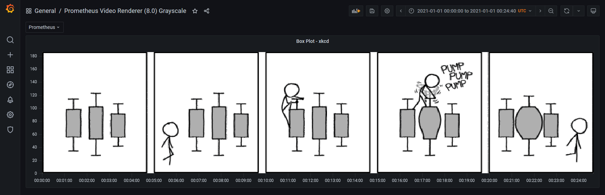
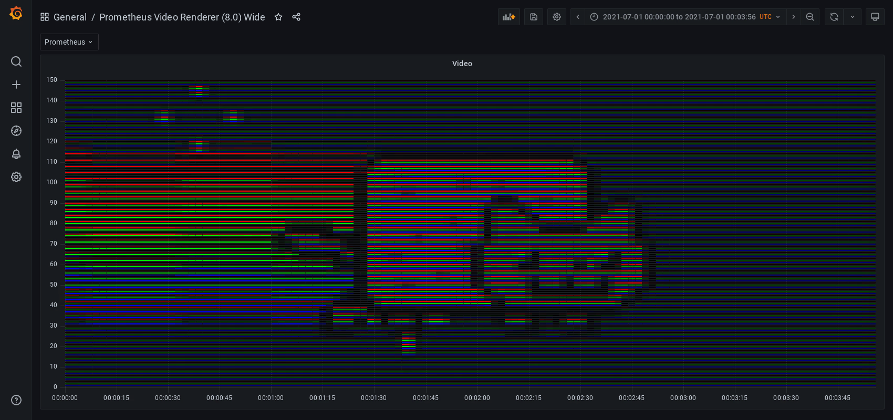

# prometheus_video_renderer

Encode media into [Prometheus](https://prometheus.io/) metrics, display/render through the Prometheus UI or [Grafana](https://grafana.com/).

Works with: PNG, WAV, and PNG sequences (aka Video)!

## Modes

Currently 3 different modes are supported.

### Bitmap

The bitmap mode either creates a sample or does not, depending on the brightness of the source image. It is the only mode compatible with the Prometheus UI.

Example: https://www.youtube.com/watch?v=ApJxFprSTqA

### Grayscale

The RGB mode creates a metric and sets a brightness label matching an override for each unique brightness.

This is made with 256 unique overrides.

### RGB

The RGB mode creates offset metrics for red, green, and blue, and sets a brightness label matching an override for each unique color/brightness.

This is 22-bit color, made with 640 unique overrides.

Example: https://www.youtube.com/watch?v=aLvh0oId3Go

## Audio

You can store and stream wave files using prometheus_jukebox.

Example: https://www.youtube.com/watch?v=psk20qGVF10

## Inspiration

A while back I thought [giedrius's blog post on storing ascii art in Prometheus](https://giedrius.blog/2019/09/21/is-it-a-good-idea-to-use-prometheus-for-storing-ascii-paintings/) and the corresponding [source code](https://github.com/GiedriusS/prometheuspainter) were really fun. After seeing some of [kevinjycui](https://github.com/kevinjycui/bad-apple)'s bad apple videos I thought combining these two ideas could be an interesting (and hilariously terrible) idea!

## Installation / Usage

See docs on the [renderer](docs/renderer.md) and [jukebox](docs/jukebox.md).
