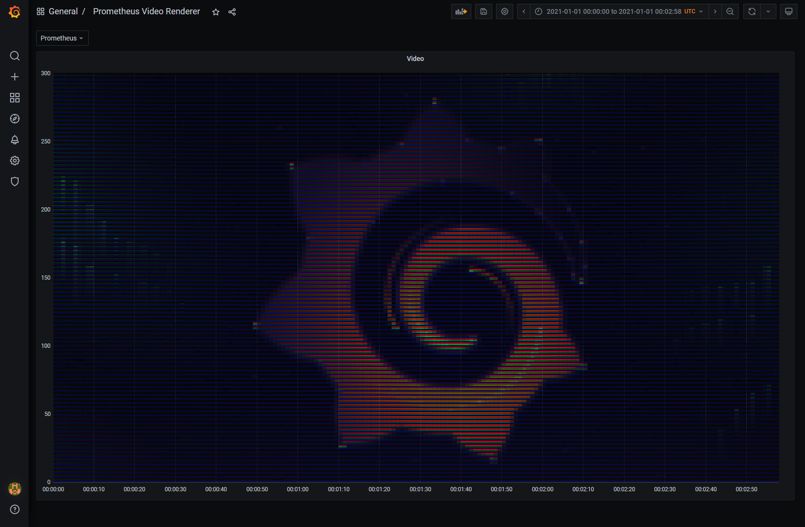

# prometheus_video_renderer

Plays videos using [Prometheus](https://prometheus.io/) and [Grafana](https://grafana.com/), e.g. [Bad Apple](https://www.youtube.com/watch?v=ApJxFprSTqA).



## Modes

Currently 3 different modes are supported.

### Bitmap

The bitmap mode either creates a sample or does not, depending on the brightness of the source image. It is the only mode compatible with the Prometheus UI.


Example: https://www.youtube.com/watch?v=ApJxFprSTqA

### Grayscale

The RGB mode creates a metric and sets a brightness label matching an override for each unique brightness.

This is made with 256 unique overrides.

Example coming soon.

### RGB

The RGB mode creates offset metrics for red, green, and blue, and sets a brightness label matching an override for each unique color/brightness.

This is 22-bit color, made with 640 unique overrides.

Example: https://www.youtube.com/watch?v=aLvh0oId3Go

## Audio

You can store and stream WAVs using prometheus_jukebox.

Example: https://www.youtube.com/watch?v=psk20qGVF10

## Inspiration

A while back I thought [this blog post](https://giedrius.blog/2019/09/21/is-it-a-good-idea-to-use-prometheus-for-storing-ascii-paintings/) and the corresponding [source code](https://github.com/GiedriusS/prometheuspainter) were kind of fun. After seeing some of [kevinjycui](https://github.com/kevinjycui/bad-apple)'s bad apple videos I thought combining these two ideas could be an interesting (and hilariously terrible) idea.

## How to use

### Video Renderer

Install with:

```text
go get -u github.com/MacroPower/prometheus_video_renderer/cmd/prometheus_video_renderer
```

1. Obtain a video, e.g. `bad_apple.mkv`
1. Figure out the output resolution, you should scale 1:1 with height being the number of time series you want.
   - If you're using Grafana, 100 height works well.
   - On Prometheus, 135 height works well.
1. Get a PNG sequence from your video, scaled to the resolution you want.
   - `ffmpeg -i 'bad_apple.mkv' -vf 'scale=180:135' -vsync 0 'out%06d.png'`
   - You can also use handbrake to scale the video to avoid doing that through ffmpeg.
1. (Prometheus Only) Add 1px white bars to each frame to avoid y axis changes.
   - `ffmpeg -i 'out%06d.png' -vf 'crop=in_w:in_h-1:0:1,pad=iw+0:ih+1:0:1:#FFFFFF@1,format=rgb24' -y 'out%06d.png'`
   - `ffmpeg -i 'out%06d.png' -vf 'crop=in_w:in_h-1:0:-1,pad=iw+0:ih+1:0:-1:#FFFFFF@1,format=rgb24' -y 'out%06d.png'`
1. Run `prometheus_video_renderer` to generate metrics. (See below for usage.)
   - To also include audio, you must pass a WAV file with a matching sample rate to `--write-wav`
   - You can match the sample rate with `sox in.wav -r 99 out.wav dither`, where 99 is the number of samples per frame multiplied by fps.
1. Loop over generated metrics and send them to `promtool tsdb create-blocks-from openmetrics`
   - Helper script [here](scripts/load.ps1)
1. Run `docker compose up`
   - If you want to improve Grafana render speed (at the cost of additional cpu/memory), increase `RENDERING_CLUSTERING_MAX_CONCURRENCY`.
1. Optionally, wait for Prometheus to compact. This will help prevent OOMs, timeouts and such.
1. Record all frames from the Prometheus or Grafana UI.
   - If you're using Prometheus, it's fast enough that you can use AHK. (Mediocre example in the scripts directory.)
   - If you're using Grafana, you will probably want to use [grafana-image-renderer-cli](https://github.com/MacroPower/grafana-image-renderer-sdk-go). (See below for details.)
1. `cd` to wherever you stored your frames and generate the video file with `ffmpeg -framerate 30 -i '%06d.png'` + any of the following:
   - Fast output: `-c:v libx264 -pix_fmt yuv420p out.mp4`
   - High quality output: `-c:v libx264rgb -pix_fmt rgb24 -preset veryslow -crf 0 -qp 0 out.mp4`
   - Merge with wav: `-i input.wav -c:v copy -c:a aac -c:v libx264rgb -pix_fmt rgb24 out.mp4`
   - Merge with audio from original video: `-i input.mp4 -c copy -map 0:0 -map 1:1 -c:v libx264rgb -pix_fmt rgb24 out.mp4`
   - Upscale: `-c:v libx264rgb -pix_fmt rgb24 -vf scale=2560:2200:flags=neighbor out.mp4`

```text
$ prometheus_video_renderer --help

Usage of prometheus_video_renderer:
  -bitmap-light-threshold int
        Brightness required to write a sample (1-255) (default 127)
  -frame-duration duration
        The max duration that can be used to write samples. Must be greater than the horizontal resolution times the scrape interval. (default 5m0s)
  -frames-location string
        Location of png frames (default "frames")
  -frames-per-file int
        Number of frames to include in each metrics file (default 120)
  -metrics-location string
        Location to write metrics (default "metrics")
  -mode string
        One of: [bitmap, grayscale, rgb] (default "bitmap")
  -project string
        The name of the project
  -scrape-interval int
        The frequency at which new samples are written (default 1)
  -start-time int
        The starting timestamp (Unix MS) of the render
  -write-wav string
        Optional .WAV file to write alongside video
```

If you intend to use Grafana, I highly recommend getting my
[grafana-image-renderer-cli](https://github.com/MacroPower/grafana-image-renderer-sdk-go)
as the sequencer package makes automating the rendering process a lot faster and
easier.

- `frame-interval` should be set to the same as `frame-duration`.
- `end-padding` removes any excess time that could not be filled with your `frame-duration`. For example, a video with 128px width, with a 5m duration and 1s scrape interval, will use 256 seconds which is 44 seconds less than the duration. Thus, the `end-padding` should be -44s. (In general using multiples of 5 is better than giving an exact `frame-duration` because it will keep the Grafana UI more static.)

```text
$ grafana-image-renderer-cli sequence \
    --api-url=http://localhost:3000 \
    --api-key-or-basic-auth=admin:admin \
    --dashboard=pvr-dash-8 \
    --start-time=1256428800000 \
    --frame-interval=5m \
    --end-padding=-44s \
    --end-frame=5
```

### Jukebox

Install with:

```text
go get -u github.com/MacroPower/prometheus_video_renderer/cmd/prometheus_jukebox
```

Note that this requires several labels that describe playback behavior, and you need to make sure that the record and playback `name` and `start-time` are aligned (technically you could start playback anywhere in the track).

#### Recording

1. Obtain a WAV file, e.g. `cantina.wav`
1. Mix to mono. (Stereo should be possible but I've not implemented it yet.)
1. Downsample as needed, it should always work due to metadata in the labels.
1. Run `prometheus_jukebox record` to generate metrics. (See below for usage.)
1. Loop over generated metrics and send them to `promtool tsdb create-blocks-from openmetrics`
   - Helper script [here](scripts/load.ps1)
1. Run `docker compose up`
1. Proceed to playback if you so choose.

```text
$ prometheus_jukebox record --help

Usage of record:
  -file string
        WAV file to source
  -name string
        Name of the track
  -scrape-interval int
        Frequency in seconds at which samples are written (default 1)
  -start-time int
        The starting timestamp (Unix MS) of the track
```

#### Playback

You can stream recorded audio directly from Prometheus. Samples are broken into
small chunks that are queried consecutively. Playback is stopped when the metric
is absent or when you manually stop the program.

```text
$ prometheus_jukebox playback --help

Usage of playback:
  -chunk-size duration
        Amount of time to query at once (default 2h0m0s)
  -name string
        Name of the track
  -prometheus-url string
        Prometheus URL
  -start-time int
        The starting timestamp (Unix MS) of the track
```

You can also visualize the playback in Grafana, by using
[grafana-image-renderer-cli](https://github.com/MacroPower/grafana-image-renderer-sdk-go)
sequencer to create a timelapse of the waveform in Prometheus that matches with
playback. You'll need to use a few specific arguments:

> Where `space = total duration of the metric inside Prometheus in seconds` ...

- `interval` is `space / ( (length of track in seconds) * (desired fps) )`.
- `start-padding` should be a negative duration equal to the desired view size.
- `end-padding` should be `interval * -1`.
- `end-frame` is `space / interval` OR `( space + (start padding in seconds) ) / interval`.

Example with 60s track, 30fps, start: 1420070400000, end: 1421393445495, 24h view:

```shell
$ grafana-image-renderer-cli sequence \
    --api-url=http://localhost:3000 \
    --api-key-or-basic-auth=admin:admin \
    --dashboard=ZpUQVIg7k \
    --start-time=1420070400000 \
    --frame-interval=735s \
    --start-padding=-24h \
    --end-padding=-735s \
    --end-frame=1800
```
